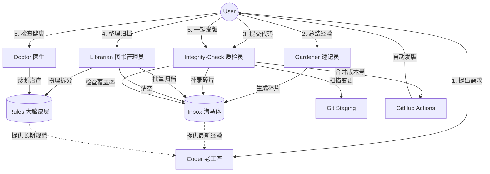

# 知识引擎使用帮助与目录指南 (HELP.md)

欢迎使用 知识引擎！本文档旨在帮助你快速了解项目结构、各目录功能以及如何使用本项目的知识引擎。

## 1. 核心目录结构说明

| 目录路径 | 中文名称 | 功能与用途 |
| :--- | :--- | :--- |
| **`.trae/`** | **Trae 配置与知识库** | **项目的“大脑”**。存放 AI 配置、知识库规则、技能包和设计文档。 |
| ├── `rules/` | 规则库 | 存放项目的技术规范、代码风格和模块文档。AI 写代码前会查阅这里。 |
| ├── `skills/` | 技能包 | 存放 AI 的能力扩展 (如 `coder`, `knowledge-gardener`, `knowledge-librarian` 等)。 |
| ├── `specs/` | 设计规范 | 存放功能开发的设计文档 (Spec, Tasks, Checklist)。 |
| ├── `documents/` | 项目文档 | 存放项目产生的各类技术文档和架构建议书。 |
| ├── `logs/` | 日志目录 | 存放更新日志、错误日志和决策日志。 |
| ├── `temp/` | 临时目录 | 存放临时文件。 |
| └── `trash/` | 回收站 | 存放待删除的文件。 |

## 2. 根目录关键文件说明

| 文件名 | 用途 |
| :--- | :--- |
| `README.md` | 项目主页，介绍项目背景、安装和使用方法。 |
| `.trae/logs/UPDATE_LOG.md` | **变更日志**。记录每次代码修改的内容，AI 会自动维护。 |
| `package.json` | npm 包管理文件，定义了项目依赖和构建脚本（如果适用）。 |

## 3. 知识引擎原理与机制

知识引擎采用 **“规则 (Rules) + 技能 (Skills)”** 的双引擎架构，旨在让 AI 像人类开发者一样“有记忆”、“守规矩”。

### 3.1 核心原理：类脑记忆机制 (Brain-Inspired Memory)

知识引擎模仿了人脑的记忆处理流程，分为三级存储：

1.  **工作记忆 (Working Memory)** -> **上下文窗口**
    *   你正在和 AI 聊天的内容，容量有限，关掉就忘。
2.  **海马体 (Hippocampus)** -> **Inbox (`.trae/rules/inbox/`)**
    *   **短期记忆区**。存放当天产生的新经验、新 Bug 修复记录。
    *   特点：写入快，未整理，碎片化。
3.  **大脑皮层 (Cortex)** -> **Rules (`.trae/rules/modules/`)**
    *   **长期记忆区**。存放经过验证、结构化的项目规范。
    *   **Index Pattern**: 采用原子文件 + 目录索引的结构，避免大文件臃肿。
    *   特点：读取快，结构严谨，永久有效。

### 3.2 运作机制：闭环进化

1.  **感知 (Gardener)**：开发过程中，AI 将新经验快速记入 **Inbox**（海马体）。
2.  **执行 (Coder)**：写代码时，AI 同时调取 **Rules**（皮层）和 **Inbox**（海马体），确保用到最新知识。
3.  **睡眠整理 (Librarian)**：系统空闲时，AI 将 Inbox 的碎片批量归档进 Rules，并对大文件进行拆分治理，完成记忆固化。

### 3.3 Skill 角色图鉴 (Skill Roles)

为了方便理解，我们将每个 Skill 比喻为一个特定的职业角色：

| Skill 名称 | 中文代号 | 形象比喻 | 职责 (Job Description) |
| :--- | :--- | :--- | :--- |
| **`coder`** | **老工匠** | **前额叶 (执行)** | **写代码的**。干活前先查规矩 (Rules)，也会瞟一眼备忘录 (Inbox)，确保活儿做得漂亮且合规。 |
| **`knowledge-gardener`** | **速记员** | **海马体 (感知)** | **记笔记的**。你随口说的经验、踩过的坑，它立马记在便利贴 (Inbox) 上，不让灵感溜走。 |
| **`knowledge-librarian`** | **图书管理员** | **睡眠整理 (内化)** | **整理书架的**。趁你休息时，把便利贴批量归档 (Batch Merge)，并把厚书拆分成小册子 (Split)，把没用的扔掉。 |
| **`integrity-check`** | **质检员** | **免疫系统 (防御)** | **守大门的**。提交代码前主动扫描变更，自动生成规范的 Commit Message。**兼任发布员**，负责一键发版 (Release)。 |
| **`knowledge-doctor`** | **医生** | **诊断与治疗** | **检查健康的**。扫描 Rules 模块，诊断格式、正确性、去重、拆分等问题，并进行治疗。 |
| **`skill-creator`** | **技能创建者** | **能力扩展** | **创建新技能的**。帮助初始化、打包和验证新技能。 |
| **`webapp-testing`** | **测试工程师** | **质量保证** | **测试 Web 应用的**。使用 Playwright 测试前端功能，调试 UI 行为，捕获浏览器截图和日志。 |

### 3.4 知识引擎运转全流程 (The Flow)

## 4. 如何使用 AI 知识引擎

本项目内置了强大的 AI 知识引擎，你可以通过以下指令让 AI 帮你干活：

### 场景 A：我要写新功能 / 改 Bug
**指令**：`/skill coder [你的需求]`
*   **示例**：“/skill coder 我想优化一下 Canvas 的拖拽性能，有点卡顿。”
*   **AI 动作**：自动查阅 **Rules (长期记忆)** 中的规范，并快速扫描 **Inbox (短期记忆)** 里的最新经验，确保代码既合规又避坑。

### 场景 B：我想总结经验 / 记录 Bug
**指令**：`/skill knowledge-gardener [你的总结]`
*   **示例**：“/skill knowledge-gardener 刚才解决的那个内存泄漏问题，把解决方法记录下来。”
*   **AI 动作**：快速提取经验，生成一个碎片文件暂存到 **Inbox** (海马体)，不打断你的开发心流。

### 场景 C：提交代码前检查
**指令**：`/skill integrity-check` (或者直接说“帮我提交代码”)
*   **AI 动作**：
    1.  **自动扫描**：检查代码变更是否已在 Inbox 有对应笔记。
    2.  **交互修复**：若无笔记，AI 会问你“要不要补录？”，确认后自动生成笔记。
    3.  **自动提交**：生成符合 Conventional Commits 规范的 Commit Message，并静默提交。

### 场景 D：整理知识库 (睡眠整理)
**指令**：`/skill knowledge-librarian`
*   **示例**：“/skill knowledge-librarian 整理一下这周的 Inbox。”
*   **AI 动作**：像图书管理员一样，把 Inbox 里的碎片文件批量归档 (Batch Merge) 进长期规则库 (Rules)，并对大文件进行拆分治理，最后清空 Inbox。建议每周运行一次。

### 场景 E：检查知识库健康
**指令**：`/skill knowledge-doctor`
*   **示例**：“/skill knowledge-doctor 检查一下 Rules 模块的健康状况。”
*   **AI 动作**：扫描 Rules 模块，诊断格式、正确性、去重、拆分等问题，并进行治疗，确保知识库的健康状态。

### 场景 F：创建新技能
**指令**：`/skill skill-creator [技能名称]`
*   **示例**：“/skill skill-creator 创建一个新的测试技能。”
*   **AI 动作**：帮助初始化、打包和验证新技能，扩展知识引擎的能力。

### 场景 G：测试 Web 应用
**指令**：`/skill webapp-testing [测试需求]`
*   **示例**：“/skill webapp-testing 测试一下登录功能是否正常。”
*   **AI 动作**：使用 Playwright 测试前端功能，调试 UI 行为，捕获浏览器截图和日志。

### 场景 H：安装和更新知识引擎
**指令**：`/skill knowledge-engine-manager`
*   **示例**："/skill knowledge-engine-manager 安装知识引擎。"
*   **AI 动作**：检查目录结构，安装或更新知识引擎，管理依赖，确保知识引擎的完整性和稳定性。

### 场景 I：版本管理和发布
**指令**：`/skill integrity-check`
*   **示例**："/skill integrity-check 帮我发布版本。"
*   **AI 动作**：检查代码变更的 Inbox 覆盖率，确保所有重要变更都有记录，生成符合规范的版本发布信息，协助完成版本管理和发布流程。

## 5. 快速参考

| 场景 | 技能名称 | 触发指令 | 自然语言触发 |
| :--- | :--- | :--- | :--- |
| **写代码/改 Bug** | coder | `/skill coder [需求]` | "帮我写代码"、"修复这个 Bug"、"优化性能" |
| **记录经验/笔记** | knowledge-gardener | `/skill knowledge-gardener [总结]` | "记录经验"、"保存到 inbox"、"生成笔记"、总结经验 |
| **提交代码检查** | integrity-check | `/skill integrity-check` | "帮我提交代码"、"检查代码"、"帮我提交推送代码" |
| **整理知识库** | knowledge-librarian | `/skill knowledge-librarian` | "整理 Inbox"、"归档知识" |
| **检查知识库健康** | knowledge-doctor | `/skill knowledge-doctor` | "检查知识库健康"、"诊断 Rules" |
| **创建新技能** | skill-creator | `/skill skill-creator [技能名称]` | "创建新技能"、"打包技能" |
| **测试 Web 应用** | webapp-testing | `/skill webapp-testing [测试需求]` | "测试登录功能"、"调试 UI 行为" |
| **版本管理/发布** | integrity-check | `/skill integrity-check` | "帮我发布版本"、"版本管理"、"一键发版" |
| **安装/更新知识引擎** | knowledge-engine-manager | `/skill knowledge-engine-manager [操作]` | "安装知识引擎"、"更新知识库"、"重新安装知识库" |

## 6. 常见问题 (Q&A)

*   **Q: 我看不懂代码，怎么知道文件放哪了？**
    *   A: 直接问 AI：“xxx 功能的代码在哪里？” 它会查阅相关文档告诉你。
*   **Q: `.trae` 目录下的文件我可以删吗？**
    *   A: **最好不要删**。那是 AI 的记忆库，删了它就变“笨”了。
*   **Q: 如何更新知识引擎？**
    *   A: 使用 `/skill knowledge-engine-manager` 指令，它会自动检查更新并执行相应操作。

---
*文档更新时间：2026-03-09*